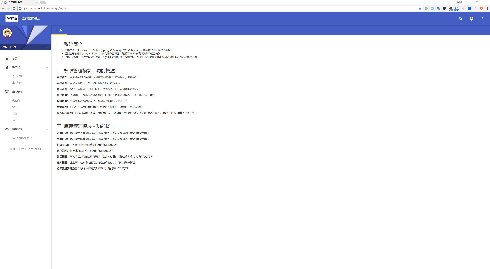
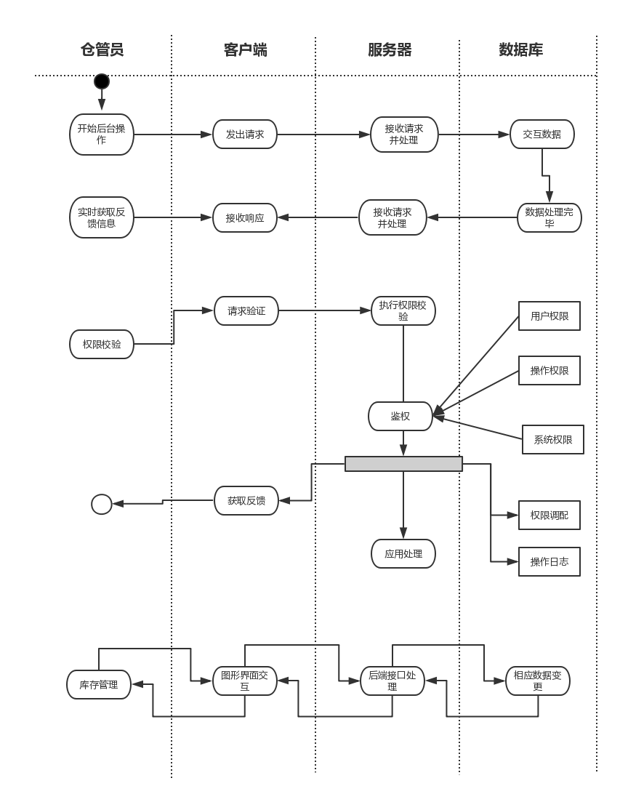

# 仓库管理系统

  一款分布式仓库管理系统，采用分布式 [zheng](https://github.com/shuzheng/zheng) 框架执行架构，目前具备 “权限管理模块系统” 和 ”库存管理模块系统“，功能分离，业务解耦。

## 项目设计
- 
- 
- 

## 开发计划
- [x] 后台界面调整
- [x] 完善库存管理模块功能
- [x] 库存阈值监控，日志监控
- [ ] 邮件提醒功能
  - 特殊情况
  - 库存问题
  - 非法操作
  - 流量限制
- [ ] 中间层缓存优化
- [ ] 自动化测试
